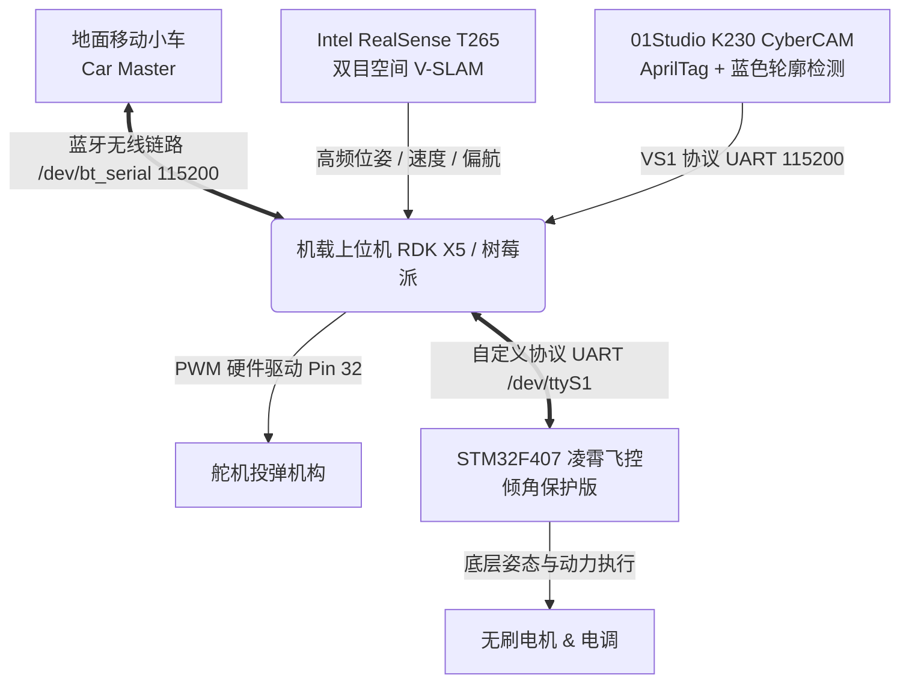

# 自研完整无人机实战系统 (Autonomous Drone System)

> **全套自研闭环无人机系统**  
> 涵盖 STM32F407 底层飞控二次开发（硬件级防侧翻倾角保护与自定义串口协议）、01Studio K230 (CyberCAM) 边缘视觉检测、机载上位机（RDK X5 / 树莓派）自主状态机决策，以及作者实测飞行演示。

---

## 🎬 作者实测飞行演示 (Flight Demos)

以下视频均为**作者实机飞行测试实录**，涵盖自主识别、空间避障、动态跟随与精准降落全流程：

| 演示视频 | 实测功能与任务场景 | 视频规格 | 本地路径 |
| :--- | :--- | :--- | :--- |
| **二维码识别降落** | 机载视觉实时解算二维码相对位姿，引导无人机平稳降准着陆 | 720×1280 竖屏 (32MB) | [`demos/二维码.mp4`](demos/二维码.mp4) |
| **火源识别与处理** | 下视相机多色域分割与火源定位，高空悬停与精准处置 | 720×1280 竖屏 (11MB) | [`demos/火源.mp4`](demos/火源.mp4) |
| **自主绕杆避障** | 基于机载双目定位与航点连续规划，平滑绕杆巡航 | 720×406 横屏 (9MB) | [`demos/绕杆.mp4`](demos/绕杆.mp4) |
| **移动平台精准降落** | 动态追踪移动靶标平台，自适应下洗气流平稳着陆 | 960×720 横屏 (10MB) | [`demos/降落.mp4`](demos/降落.mp4) |

---

## 📖 系统软硬件协同架构



---

## 📁 模块构成与源码目录

```
drone-system/
├── README.md                           # 本说明文档
│
├── 🎬 demos/                           # 【作者实机飞行演示视频库】
│   ├── 二维码.mp4                      # 二维码识别与精准降落演示
│   ├── 火源.mp4                        # 火源定位与处理演示
│   ├── 绕杆.mp4                        # 绕杆与自主避障飞行演示
│   └── 降落.mp4                        # 移动靶标精准降落演示
│
├── 🛸 flight-controller/               # 【底层飞控固件】（STM32F407 Keil MDK）
│   ├── FcSrc/                          # 凌霄官方飞控核心（姿态解算、内环PID）
│   ├── DriversMcu/                     # STM32F407 底层硬件驱动库
│   ├── Mycode/                         # 二次开发自研核心逻辑
│   │   ├── angle_protect.c / .h        # 硬件级倾角防侧翻切断保护（防止近地翻滚炸机）
│   │   ├── my_protocol.c / .h          # 上位机自定义双向通信与航点指令协议
│   │   └── my_fun.c / .h               # 辅助逻辑扩展
│   └── ProjectSTM32F407/               # Keil 工程与预编译固件
│       ├── ANO_LX_STM32F407.uvprojx    # 飞控工程主文件
│       └── ANO-LX.bin / ANO_LX.hex     # 已验证稳定固件镜像
│
├── 📷 edge-vision/                     # 【K230 (CyberCAM) 边缘视觉子系统】
│   ├── boards/cybercam_d/              # 视觉端部署工程
│   │   ├── detector.py                 # AprilTag(tag36h11) + 蓝色方块融合检测器
│   │   ├── protocol.py                 # ASCII VS1 协议帧打包器
│   │   ├── main.py                     # CSI 取流与视觉伺服数据流主循环
│   │   └── run_flight.sh               # 飞行模式高帧率启动脚本
│   └── cybercam-flight.service         # systemd 开机自启服务配置
│
└── 🧠 companion-computer/              # 【机载上位机决策核心】（Python 3.10+）
    ├── main.py                         # 系统入口与核心状态机调度
    ├── config.json                     # 全局参数配置（航线、PID、通信参数）
    ├── auto_start.py                   # 开机自检、空地握手与自动化起飞调度
    ├── task1_start.py / task1_flight.py # Task 1：伴飞巡航与精准投放主程序
    ├── task2_start.py / task2_flight.py # Task 2：动态小车跟踪、移动降落与二次起飞
    ├── dynamic_landing.py              # 动态移动平台降落决策与触板检测
    ├── coordinate_alignment.py         # 机身/相机/地面全局坐标系对齐转换
    ├── dual_t265_coordinate_calibration.py # 双 T265 坐标系空间联合标定
    ├── comm_diagnostic.py              # 空地通信链路与飞控通信诊断
    ├── payload_servo.py                # 硬件 PWM 舵机投放执行器
    ├── rdk_oled_monitor.py             # RDK X5 板载 OLED 状态实时刷新屏显
    ├── tests/                          # 20+ 项单元测试（涵盖协议、安全契约与模拟测试）
    └── competition-2026-d-autostart.service # 机载 Linux systemd 自启动脚本
```

---

## ⚙️ 核心技术创新点

### 1. 飞控倾角超限主动安全切断 (`angle_protect`)
在电赛近地伴飞与小车降落过程中，气流扰动容易导致边缘下洗流诱发机体倾角突变。底层固件增加了即时姿态安全防护：
- 实时检测 Roll / Pitch 绝对值：当倾角超出阈值（默认 30°），立即触发防侧翻响应与电机安全急停，杜绝地面“翻滚刮桨”。

### 2. 双重视觉融合检测 (`detector.py`)
结合 K230 硬件加速：
- **近距离精定位**：AprilTag (`tag36h11`, ID 0)，利用角点 PnP 解算精确的亚厘米级相对位姿。
- **远距离宽视场捕捉**：HSV 蓝色色块自适应多边形轮廓逼近，即使在超出 AprilTag 解析距离时仍能稳定锁定小车中心。

### 3. 空地高可靠遥测链路 (`bluetooth`)
- 机载与地面车通过 `/dev/bt_serial`（115200）建立 10Hz 双向心跳；
- 支持超时自动重传（ACK 重试 4 次）、速度前馈与丢包安全降级悬停。

---

## 🚀 部署与使用说明

### 1. 硬件连接引脚表

| 设备 | 接口 | 引脚 / 端口 | 协议 / 速率 |
|------|------|------------|-------------|
| **飞控 (STM32F407)** | UART | `/dev/ttyS1` | 凌霄私有协议 / 500000 bps |
| **视觉端 (K230)** | UART | `/dev/ttyS7` | VS1 ASCII 协议 / 115200 bps |
| **地面车通信** | 蓝牙串口 | `/dev/bt_serial` | 空地双向帧 / 115200 bps |
| **空间定位 (T265)** | USB 3.0 | USB 直连 | Librealsense V-SLAM |
| **投弹舵机** | PWM | Physical Pin 32 (PWM0) | 50Hz 周期脉宽控制 |

### 2. 机载上位机运行

```bash
# 1. 进入上位机工作目录
cd drone-system/companion-computer

# 2. 运行自动化系统与链路诊断
python3 comm_diagnostic.py

# 3. 执行 Task 1（伴飞投放）
python3 task1_start.py

# 4. 执行 Task 2（动态追踪降落）
python3 task2_start.py
```
