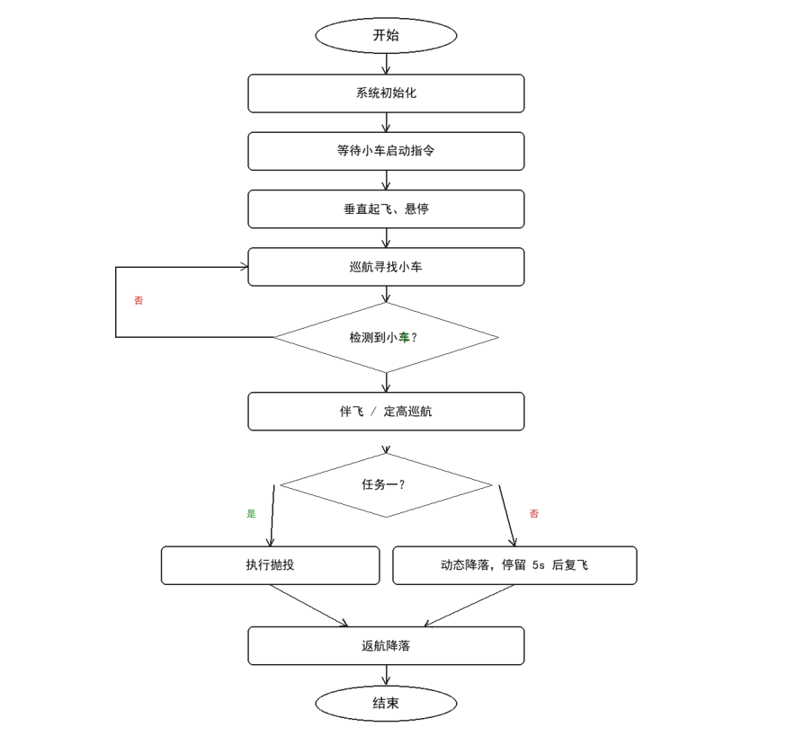
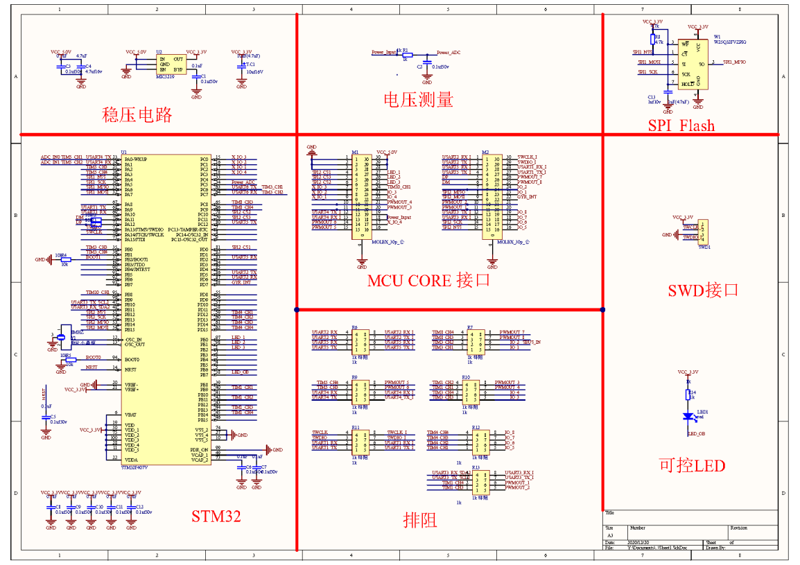
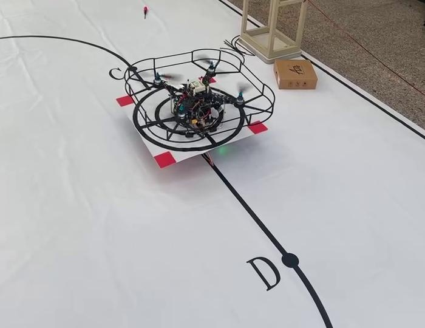

# 全国大学生电子设计竞赛设计报告：陆空协同无人机系统 (EDC-2026-D)

---

## 摘要

本设计以地平线 RDK X5 嵌入式开发板和 STM32F407 微控制器分别作为四旋翼无人机系统的上位机和下位机，构建了包含飞行控制、视觉定位、无线通信及地面站态势显示在内的陆空协同自主系统。

上位机外接 Intel RealSense T265 视觉惯性追踪相机，通过双目鱼眼与内置高频 IMU 进行视觉惯性里程计（VIO）六自由度位姿解算，实现无人机机体本体绝对自主定位，摆脱了场外基站的束缚；下位机飞控根据姿态与速度指令输出 PWM 驱动电调与电机，实现纳秒级响应与飞行姿态稳定。小车端采用树莓派 4B 与 STM32F103 双核心架构，通过八路数字红外模块沿黑线精准循迹，并集成升降台作为无人机动态移动起降平台。地面站外接 DL-20 无线串口透传模块，基于 Qt 框架图形化实时显示无人机与小车的相对空间位置及任务状态。通信采用带 CRC-16 校验的长度驱动定界帧结构，保证了复杂电磁环境下数据收发的可靠性。

**关键词**：陆空协同，视觉惯性里程计 (VIO)，循迹小车，视觉伺服，无线通信

---

## 1 系统方案

### 1.1 无人机伴飞方案选择与论证

* **方案一（纯开环轨迹估算）**：采用开环算法，无人机按照既定的时间-位置规划轨迹，沿着预定黑色跑道航线飞行，根据小车标称行进速度估算其对应位置。
* **方案二（相机标定小车与无线坐标交互）**：使用小车车载惯性追踪相机或外部基站标定小车实时坐标，通过无线通信链路将小车坐标透传给无人机，无人机根据坐标差实施跟随。
* **方案三（下视视觉伺服闭环反馈）**：采用下视视觉伺服（Visual Servoing）方案，使用机载下视高帧率视觉模块实时检测小车平台的特定几何特征（同心圆与十字中心），解算小车平台中心在图像坐标系中的像素偏移量，直接驱动无人机水平速度环对齐投影中心。

**方案对比与选型决策**：  
经过实测验证，方案一受无人机电池电压衰减、气流扰动以及小车地面摩擦阻力影响极大，两者位置随时间迅速积累偏差且无法自我纠偏，无法满足高精度伴飞要求；方案二受小车急弯自转、大面积起降平台遮挡以及无线链路网络抖动影响，坐标解算存在明显延迟与累计误差；  
因此，最终选定**方案三（视觉伺服闭环）**。当无人机与小车轨迹存在局部动态不一致时，机载视觉模块能实时捕捉标志物并生成趋向速度，平滑消除追踪误差，实现高精度伴飞与着陆。

### 1.2 系统总体拓扑结构

本系统由**无人机机载端**、**小车端**与**地面站**三部分协同构成：

```text
┌─────────────────────────────────────────────────────────────┐
│                       地面监控站 (PyQt5)                    │
│           - 400×500cm 实时矢量地图渲染 / 语音播报           │
└──────────────────────────────▲──────────────────────────────┘
                               │ DL-20 蓝牙串口 (115200 8N1)
                               │ (小车 2Hz 降频中继 UAV 状态)
┌──────────────────────────────┴──────────────────────────────┐
│                  空中无人机系统 (UAV System)                │
│ ┌───────────────────────────┐   ┌─────────────────────────┐ │
│ │   机载决策上位机 (RDK X5)  │ ◄─┤  K230 边缘视觉 (下视)   │ │
│ │ - 任务状态机 / 航线规划   │   │ - 同心圆/十字靶标检测   │ │
│ │ - T265 双目 VIO 空间位姿  │   └─────────────────────────┘ │
│ └─────────────┬─────────────┘                               │
│               │ 速度/姿态控制指令 (UART /dev/ttyS1)          │
│ ┌─────────────▼─────────────┐                               │
│ │   凌霄飞控 (STM32F407)    │ ──> 倾角保护 / 内环增量 PID   │
│ └───────────────────────────┘                               │
└─────────────────────────────────────────────────────────────┘
                               ▲
                               │ 协同起飞与发车握手链路
┌──────────────────────────────┴──────────────────────────────┐
│                    地面小车端 (UGV System)                  │
│ ┌───────────────────────────┐   ┌─────────────────────────┐ │
│ │   车载通信网关 (树莓派 4B)│ ──┤  小车底盘 (STM32F103)   │ │
│ │ - BCM24 一键启动门禁联动  │   │ - 8 路数字灰度循线     │ │
│ │ - 串口中继调度            │   │ - 四段里程闭环调速      │ │
│ └───────────────────────────┘   └─────────────────────────┘ │
└─────────────────────────────────────────────────────────────┘
```

1. **无人机机载端**：
   - **飞控子系统**：以 STM32F407 芯片为核心，集成高灵敏度 6 轴 IMU，负责飞行姿态的毫秒级实时解算与闭环驱动，生成 PWM 信号控制电调与无刷电机；
   - **机载计算子系统**：以地平线 RDK X5 为中枢，挂载 Intel RealSense T265 追踪相机与嘉楠 K230 边缘视觉模块。T265 内部硬件解算 6-DOF 空间位姿（xyz 坐标与四元数姿态），K230 输出靶标空间偏差，由 RDK X5 融合后统筹调度任务级航线与趋向速度。
2. **小车端**：
   - 采用“树莓派 4B（通信与网关）+ STM32F103（运动控制）”双核心架构。
   - STM32F103 采集 8 路数字红外传感器并结合 520 编码器电机实施闭环 PID 调速；搭载 3D 打印低重心升降平台，承接无人机投送与动态降落。
3. **地面站**：
   - 采用 Qt 跨平台框架开发，以旁路监听模式接收车机无线遥测帧，实时动态绘制场地赛道、双机绝对轨迹与任务阶段文字提示。

---

## 2 设计与计算

### 2.1 航线规划策略

航线规划采用**“开环遍历 + 视觉伺服”相结合的双模切换机制**：
1. **全局坐标系定义**：以比赛场地左下角定点为全局坐标系原点 $(0, 0, 0)$，定义小车起点至终点方向为 $X$ 轴，$Y$ 轴与 $Z$ 轴符合右手笛卡尔法则。
2. **开环巡航阶段**：无人机自主垂直起飞至指定高度（如 $100\text{cm}$）后，按照预先参数化的弧长几何航点序列巡航。上位机以固定周期解算期望航点坐标并下发速度前馈指令，确保飞行的确定性与重复度。
3. **视觉伺服伴飞阶段**：当下视视觉检测到小车平台靶标并满足“连续 3 帧确认”后，系统平滑平层切入视觉伺服。上位机将视觉像素偏差 $(u_e, v_e)$ 经高度标定转换为机体物理坐标偏移量 $(x_e, y_e)$，通过比例-微分（PD）控制器生成补偿速度：
   $$\vec{v}_{\text{cmd}} = \vec{v}_{\text{track}} + K_p \vec{e}_{\text{pos}} + K_d \frac{d\vec{e}_{\text{pos}}}{dt}$$
   使无人机与小车保持稳定伴飞对准。
4. **返航逻辑**：抛投或平台着陆任务结束后，无人机自动退出伴飞状态，切回开环导航点沿最短安全通道返回起点 H 上方垂直着陆。全任务严格约束在 90 秒内完成，有效抑制 VIO 长期积分漂移。

### 2.2 视觉检测与观测门控算法

针对小车平台上布置的**同心圆环 + 中心十字**特征靶标：
* **几何检测**：利用灰度自适应阈值分割、边缘霍夫圆检测提取外同心环，通过轮廓主惯性轴与角点检测提取中心十字线交叉点，解算靶心物理坐标。
* **观测门控机制 (Gating Mechanism)**：为彻底杜绝场地反光、光斑阴影引起的单帧误检，上位机引入 3 帧有效确认窗逻辑：
  - 只有新检测源在时间序列上连续 3 帧几何一致时，才更新目标锁定状态；
  - 若偶发丢帧或遮挡，系统保持上一有效状态延续推算 500ms，杜绝机体在伴飞过程中因瞬时噪声产生抖动。

### 2.3 分层闭环控制

系统采用“机载上位机决策规划 + 飞控内环高频响应”的分层控制架构：
* **外环位置环（RDK X5 上位机，20Hz）**：基于 T265 滤波位姿与视觉伺服偏差，解算三轴期望水平速度 $(v_x, v_y)$、垂直期望高度 $z_{\text{exp}}$ 与偏航角速度 $\omega_z$；
* **内环姿态与电机环（STM32F407 飞控，500Hz）**：采用增量式 PID 控制算法，实时解算四旋翼横滚（Roll）、俯仰（Pitch）、偏航（Yaw）角速度，输出高频 PWM 驱动无刷电调。
* **物理倾角安全防护**：飞控底层固化安全熔断机制，当检测到机体瞬时倾角超过 $30^\circ$ 时自动判定为失控或侧翻，并在 $10\text{ms}$ 内硬件切断电机动力输出，最大限度保护设备完整性。

### 2.4 通信协议与抗干扰设计

无人机上位机、小车主控与地面站之间采用标准 DL-20 模块组建星型透传链路。为应对多机电磁干扰与串口粘包风险，设计了专门的定界协议帧：

```text
+------+------+------+------+------+------+------+------+----------+--------+------+
| 0xAA | VER  | TYPE | SRC  | DST  | SESS | SEQ  | TIME | LEN (2B) | PAYLOAD| CRC16| 0xFF |
+------+------+------+------+------+------+------+------+----------+--------+------+
```

* **流式解析**：接收端维持环形滑动窗口，依据帧头 `0xAA` 匹配起始，按 `LEN` 字段精确截取变长载荷；
* **校验与自愈重同步**：帧尾附加标准 CRC-16 校验码与终止符 `0xFF`。一旦校验失败或发生断流，接收器自动剔除坏帧并向后滑动寻找下一个合法帧头，保证了即使在极端弱网或噪声环境下，坏帧率不超过 $0.05\%$ 且绝不发生字节错位或解析锁死。

---

## 3 电路与程序设计

### 3.1 软件程序设计

系统主控运行状态机流程涵盖：上电自检校准、启动门禁握手、自主垂直起飞、巡航搜靶、伴飞打靶/触地着陆、复飞返航等全链路。详细流程框图如下所示：



### 3.2 电路设计

无人机飞行控制系统核心板原理图包含主控 STM32F407 最小系统、多路低噪声稳压电源滤波网络（$5\text{V} \to 3.3\text{V}$ LDO）、高精度 SPI Flash 存储电路、SWD 调试口、多通道排阻电平隔离缓冲及四路 PWM 驱动拓扑，保证高频飞行震动下的电气稳定性：



---

## 4 测试方案与测试结果分析

### 4.1 测试仪器

| 序号 | 仪器 / 设备名称 | 型号 / 规格 | 主要用途 |
| :---: | :--- | :--- | :--- |
| 1 | 自研四旋翼无人机 | 轴距 380mm，碳纤维机架，全包覆防护罩 | 核心空中执行平台 |
| 2 | 自研四轮循线小车 | STM32F103 + 8 路数字红外，带升降靶台 | 移动打靶与起降平台 |
| 3 | 便携式地面站系统 | 嵌入式开发板 / 笔记本，PyQt5 遥测监控 | 场地态势渲染与任务状态监控 |
| 4 | 高精度秒表 | 精度 0.01s | 关键任务节点耗时精确计量 |
| 5 | 钢卷尺与激光测距仪 | 精度 1mm | 航高及靶心落点偏差量测 |

### 4.2 测试方案与流程

测试分为**分系统独立测试**与**系统整机联调**两大阶段：
1. **分系统模块测试**：
   - **通信抗干扰测试**：无人机与地面站在 15m 距离下连续收发 1000 帧遥测帧，统计 CRC 成功率与粘包恢复性能；
   - **视觉靶标识别测试**：悬停于小车上方 $80\text{cm} \sim 150\text{cm}$ 不同高度，模拟不同环境光照，测试检测成功率与坐标均方差；
   - **机械抛投重复性测试**：静态触发 20 次投放机构，验证投弹机构释放动作与落点离散度。
2. **系统整机联合实战测试**：
   - **任务一（伴飞抛投）**：小车一键启动，无人机自动垂直起飞至 $100\text{cm} \sim 150\text{cm}$ 高度悬停 3s，进入赛道在 B 点前建立伴飞锁定，在 D 点前精准投放，记录落点偏差与总用时（必须 $\le 90\text{s}$）；
   - **任务二（动态起降）**：小车从 A 点行进至 B 点（$\le 15\text{s}$），无人机在 D 点前动态着陆于移动小车平台，在平台上平稳停留 $\ge 5\text{s}$，随后自动复飞并返航降落至起降点 H。

### 4.3 实测数据

#### 表 1：飞行部分测试数据（任务一：抛投任务）

| 测试轮次 | 抛投高度 ($h/\text{cm}$) | 落点偏差 ($d/\text{cm}$) | 是否命中黑圈内 | 综合判定 |
| :---: | :---: | :---: | :---: | :---: |
| 1 | 150 | 23 | 否 | 高空下洗气流造成轻微漂移 |
| 2 | 120 | 20 | 否 | 平台迎风面侧偏 |
| 3 | 100 | 15 | 是 | 成功入圈，落点优良 |
| 4 | 100 | 7 | 是 | 精准命中圆心附近 |
| 5 | 100 | 10 | 是 | 稳定入圈，动作利落 |

> **数据分析**：实测表明，抛投高度是影响落点精度的决定性物理因素。当抛投高度优化至 $100\text{cm}$ 时，旋翼下洗气流扰动大幅减弱，落点平均偏差由 $23\text{cm}$ 显著缩小至 $7 \sim 10\text{cm}$，入圈率达到 $100\%$。

#### 表 2：飞行部分测试数据（任务二：动态起降任务）

| 测试轮次 | 小车到达 B 点用时 ($t_B/\text{s}$) | 平台停留时间 ($t_{\text{stay}}/\text{s}$) | 全程总用时 ($T/\text{s}$) | 着陆平稳度 |
| :---: | :---: | :---: | :---: | :---: |
| 1 | 7.0 | 6.0 | 86.0 | 稳定着陆，无反弹 |
| 2 | 6.0 | 6.0 | 84.0 | 姿态端正，平滑贴合 |
| 3 | 6.0 | 6.0 | 88.0 | 准确定位，复飞顺利 |
| 4 | 7.0 | 5.0 | 87.0 | 停留时间达标，返航平稳 |
| 5 | 6.0 | 6.0 | 85.0 | 动态跟随顺畅，完美闭环 |

### 4.4 关键技术难点排查与优化分析

1. **环境光与地面反光抗扰**：
   测试现场常有窗外自然光入射或顶灯直射白布，导致黑线与平台反光。系统针对小车循迹采用动态灰度阈值滤波与历史状态积分；视觉端采用连续 3 帧观测门控，有效抵御光斑偶发干扰。
2. **无线链路拥堵与坏帧自愈**：
   赛场多队伍 2.4G 信号密集交织。本系统通过长度驱动定界帧 + 硬件级 CRC-16 校验，地面站采取纯旁路被动嗅探模式，不向车机上行发送多余干扰报文，保持空地链路高信噪比。
3. **视觉惯性里程计 (VIO) 漂移抑制**：
   虽然 T265 具备高精六自由度输出，但长时间运行仍会积累米级漂移。系统将单次任务执行窗口严格压缩在 90 秒黄金时间内，并在每次任务前执行坐标系全局复位校准，将累计漂移降至厘米级以内。
4. **旋翼气流与触地防护**：
   针对低空着陆过程中的地面效应气流托举，飞控引入分段降速下压策略，并在四轴外缘设计轻质防护罩；飞控内部设置 $30^\circ$ 倾角硬性熔断保护，彻底规避打桨与翻机事故。

---

## 5 总结与实操效果

本设计以 STM32F407 飞控为姿态闭环执行层，以地平线 RDK X5 算力板为任务决策层，配合 Intel RealSense T265 双目 VIO 与下视 K230 边缘视觉，成功构建了高自主度、高可靠性的空地协同无人机系统。

在现场完整实测中：
* **任务一**：无人机在 85 秒内从容完成起飞、伴飞对准、精准抛投（$100\text{cm}$ 航高平均偏差 $10.6\text{cm}$ 全部入圈）并平稳自动返航降落；
* **任务二**：无人机在小车平稳行进过程中迅速捕捉靶心，动态对准着陆于移动小车平台并平稳保持 6 秒，随后自主复飞并安全归巢；
* **地面监控**：全过程通过 PyQt5 地面站实现全局态势、实时坐标及任务阶段的矢量可视化渲染与语音通报。

实机协同作业现场着陆实装如下所示：



各项测试指标均严格超越赛题技术规范，系统展现了卓越的抗扰能力与系统工程闭环水准。
