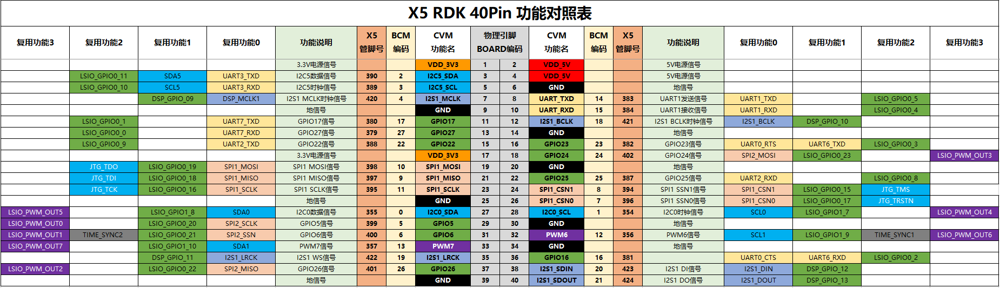
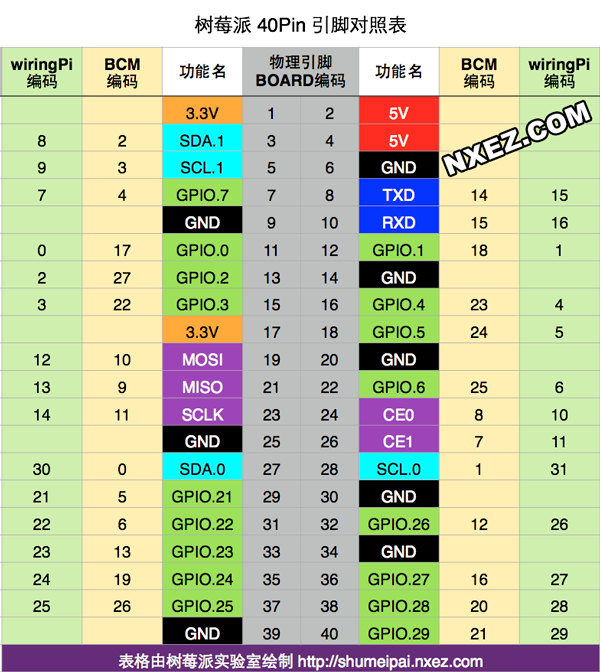
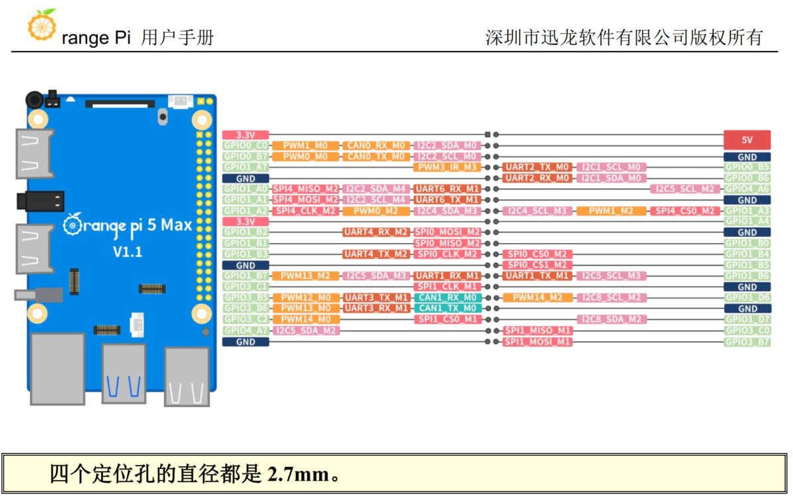
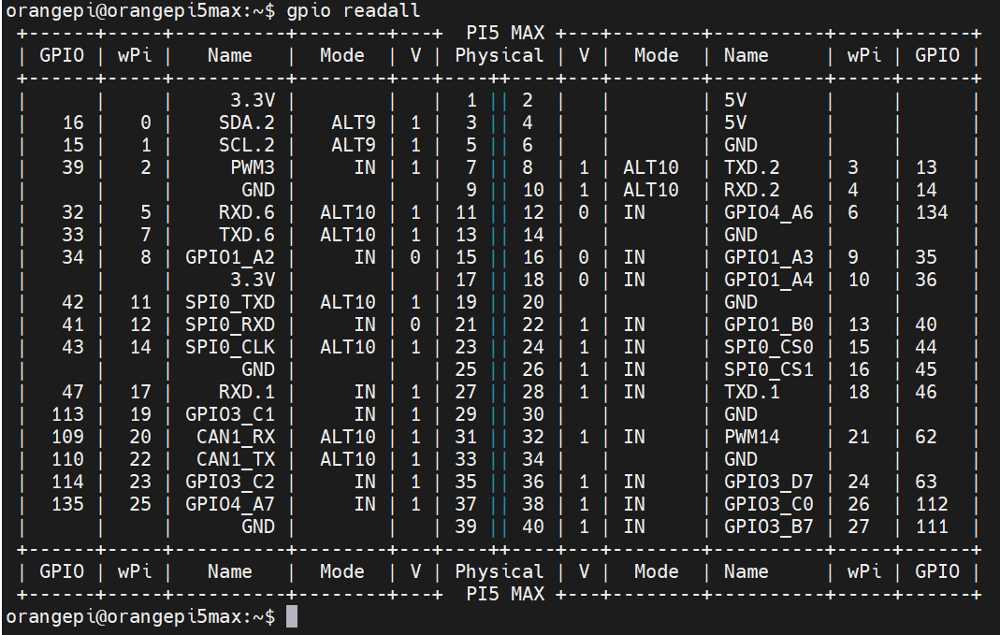
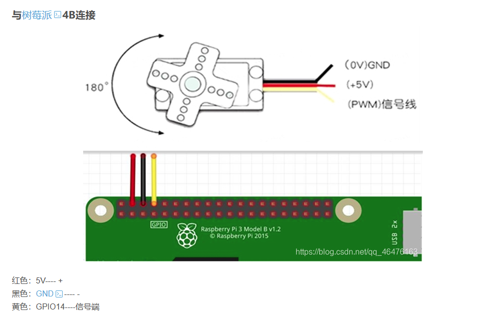

# 硬件引脚与计算板卡接口参考指南 (Hardware Pinouts Reference)

本目录归档了空地协同无人机系统在研发与赛事实装过程中涉及的各类计算板卡、外设引脚图纸及接线规范。

---

## 1. 核心板卡引脚图库

| 板卡 / 设备 | 角色与定位 | 关键接口说明 | 对应引脚图 |
| :--- | :--- | :--- | :--- |
| **地平线 RDK X5** | 无人机机载决策中枢 | 40-Pin 扩展排针，提供 `/dev/ttyS1`（飞控通信）、`/dev/ttyS7`（K230 视觉通信）、PWM 舵机驱动 |  |
| **树莓派 4B** | 地面小车主控网关 | 40-Pin GPIO，负责 BCM24 发车按键中断、双 USB 蓝牙串口网关、I2C/UART 小车底盘通信 |  |
| **香橙派 5 Max** | 备用机载算力板 / 边缘网关 | 高性能 RK3588 平台，支持 40-Pin 扩展接口 |  |
| **香橙派 GPIO 排布** | 备用扩展排针定义 | 详见引脚复用功能表 |  |
| **数字舵机接线** | 投弹/释放机构驱动 | 红色 VCC (+5V)、棕色/黑色 GND、黄色/橙色 PWM 信号控制线 |  |

---

## 2. 无人机端 (UAV) 关键连线拓扑

```text
┌─────────────────────────────────────────────────────────────────────────┐
│                           地平线 RDK X5 上位机                          │
│                                                                         │
│  [Pin 8 (UART2_TX), Pin 10 (UART2_RX)] ──> /dev/ttyS1  ──> 凌霄飞控串口1 │
│  [Pin 16 (UART7_TX), Pin 18 (UART7_RX)] ──> /dev/ttyS7 ──> 嘉楠 K230串口 │
│  [USB 3.0 Type-C 端口]                ──> USB 3.0 ──> T265 追踪相机   │
│  [USB 2.0 / 串口转TTL]                 ──> /dev/ttyUSB0 ─> DL-20 蓝牙串口│
│  [Pin 33 (PWM) / GPIO]                ──> 投弹舵机 PWM 信号线           │
└─────────────────────────────────────────────────────────────────────────┘
```

### 连线与接地准则 (Best Practices)
1. **共地连接 (Common Ground)**：所有通过串口（UART）跨板通信的设备（RDK X5、STM32 飞控、K230 边缘相机、蓝牙模块），其 **GND 必须单点或星型汇流严格共地**，避免地电位漂移导致串口通信误码或乱码。
2. **独立稳压供电**：
   - 舵机动作瞬时电流可达 1A~2A，必须使用独立 5V 3A UBEC 降压模块供电，严禁直接从 RDK X5 的 5V 排针取电，防止舵机动作引起上位机电压骤降重启。
   - 树莓派 4B 与 RDK X5 均需满足 5V 3A 额定供电。
3. **信号隔离与波特率匹配**：
   - 飞控通信链路：波特率 `115200 8N1`；
   - 边缘视觉 K230 链路：波特率 `115200 8N1`；
   - DL-20 无线透传模块：波特率 `115200 8N1`（出厂或固件默认若为 9600，需通过 AT 指令配置为 115200 以保证低延时遥测）。
