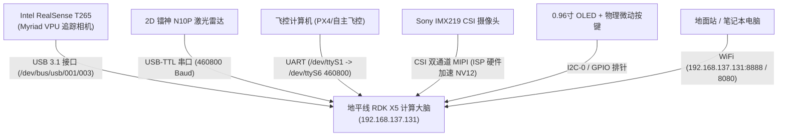

# 地平线 RDK X5 实机设备参数与板载代码全景档案
> 更新时间：2026-09-13 | 目标设备：`192.168.137.131` (`sunrise@rdk-x5`)

---

## 一、实机硬件规格与系统环境

| 指标维度 | 参数详情 | 运行状态 / 备注 |
| :--- | :--- | :--- |
| **开发板型号** | D-Robotics RDK X5 V1.0 (地平线旭日 X5) | 官方旗舰嵌入式 AI 计算卡 |
| **CPU 处理器** | 8 核 ARM Cortex-A55 @ 1.50 GHz (300~1500MHz) | 8 核运行，L1 缓存 256KB |
| **AI 算力 (BPU)** | 10 TOPS INT8 (地平线 Bayes 架构 NPU) | 已装配 `hobot_dnn`, `hbm_runtime`, `hobot_vio` v3.0.9 |
| **运行内存 (RAM)** | 8 GB LPDDR4 (可用 6.9 GiB，已用 ~718 MiB) | 空闲 4.9 GiB，带 4.0 GiB Swap 交换分区 |
| **板载存储** | 64 GB 高速存储 (根目录挂载 59 GB) | 已用 33 GB (59%)，剩余可用 24 GB |
| **核心温度** | 40.7°C ~ 42.5°C | 散热良好，高负载持续工作温度安全 |
| **操作系统** | Ubuntu 22.04.5 LTS (Jammy Jellyfish) aarch64 | Linux 内核 `6.1.83 #1 SMP PREEMPT` |
| **网络配置** | `wlan0`: **192.168.137.131/24** (局域网直连) | `eth0`: 千兆网口备用 (支持双网卡路由) |
| **开发环境** | Python 3.10.12 / ROS 2 Humble (`/opt/ros/humble`) | 支持 JupyterLab (端口 8888 守护中) |

---

## 二、外设挂载与硬件接口拓扑



### 1. 串口映射与通信波特率
- **`/dev/ttyS0`**：板载底层调试 Console 终端（`serial-getty` 启用中）；
- **`/dev/ttyS1`（软链接 `/dev/ttyS6`）**：飞控双向通信核心接口，运行波特率 **`460800`**（高频下行遥测 + 上行速度/航向角控制）；
- **`/dev/ttyUSB*` / `/dev/drone_radar`**：镭神激光雷达串口，运行波特率 **`460800`**（高速点云接收与解析）。

### 2. USB 与视觉传感器
- **Intel RealSense T265**：USB 设备 `03e7:2150 Intel Myriad VPU`，提供 200Hz 6-DoF VIO 高精度无漂移位姿与空间偏航角（Yaw）；
- **Sony IMX219 CSI 摄像头**：挂载于 `/dev/video*`，支持全志/地平线 ISP 硬件零拷贝出流，RAW10 1920x1080 与 NV12 格式直出。

---

## 三、后台守护进程与开机服务清单

| 服务名称 | 启动目标与工作目录 | 状态 | 职责功能说明 |
| :--- | :--- | :--- | :--- |
| **`competition-2026-d-autostart.service`** | `python3 -u -m competition_2026_d.auto_start`<br/>目录：`/home/sunrise/Desktop/FJJ` | **Active (Running)** | **电赛主控总入口**：开机后独占共享串口，等待起飞按键或触发指令，校验预检通过后调度巡航、目标检测与投放任务 |
| **`t265-monitor.service`** | `python3 /home/sunrise/Desktop/auto-boot/t265_monitor.py` | **Active (Running)** | **T265 追踪看门狗**：实时监控 VIO 追踪置信度（Confidence），若相机丢帧或跌落至 0 则执行硬件级重置自愈 |
| **`jupyterlab.service`** | `jupyter-lab --ip=0.0.0.0 --port=8888 --no-browser`<br/>目录：`/home/sunrise` | **Active (Running)** | **远程交互式开发环境**：网页直访 `http://192.168.137.131:8888`，密码为统一设定的 `1` |
| **`mjpeg_server.py`** | 进程级守护：`/home/sunrise/camera-stream/mjpeg_server.py` | **Active (Running)** | **轻量局域网图传服务**：将 CSI 摄像头采集到的帧推流至 HTTP 端口供地面站实时预览 |
| **`hobot-automount.service`** | 地平线系统内置服务 | **Active (Running)** | **U 盘热插拔挂载**：方便外场比赛时离线拷贝飞行日志与靶标照片 |

---

## 四、板载代码工程深度梳理

板载用户主目录 `/home/sunrise/` 下的代码工程按照功能划分清晰，重点包括**无人机电赛机载工程 (`Desktop/FJJ`)**、**雷达与点云工程**、**底层视觉与硬件控制**三大板块：

```text
/home/sunrise/
├── Desktop/
│   ├── FJJ/                                # ★★★ 无人机全自主飞控、感知与任务调度工程 (核心)
│   │   ├── basic/                         # 基础通信协议栈、飞控串口驱动与底层外设
│   │   │   ├── Lcode/
│   │   │   │   ├── Lprotocol.py           # 飞控串口协议栈 (460800波特率, 数据解包/封包/校验/速度发布)
│   │   │   │   ├── Logger.py              # 统一格式异步日志系统
│   │   │   │   ├── gpio_button.py         # 物理按键事件响应与消抖
│   │   │   │   └── ssd1306_oled.py        # 0.96寸 OLED 实时状态显示
│   │   │   └── flight_logs/               # 真实飞行遥测历史数据 (.jsonl)
│   │   ├── basic_radar/                   # 2D 激光雷达机载极速直驱与避障模块
│   │   │   ├── Lradar.py                  # 纯 Python 镭神雷达串口驱动 (460800, 线程锁保护)
│   │   │   ├── pole_tracker.py            # 细立柱空间聚类与世界坐标系时序滑窗锁定算法
│   │   │   ├── static_pole_check.py       # 起飞前地面零电机风险静态测距工具
│   │   │   ├── radar_bench_test.py        # 串口高频点云吞吐压测脚本
│   │   │   └── laser_height_monitor.py    # 光流激光高度只读监听与传感器校准
│   │   ├── competition_2026_d/            # 2026 年电赛 D 题主控与任务闭环系统
│   │   │   ├── auto_start.py              # 全局开机自启任务分发与硬件预检状态机 (主控入口)
│   │   │   ├── control/                   # 航线巡航、航点导航、机动避障控制器
│   │   │   ├── vision/                    # 视觉识别 (靶标检测、圆环识别、降落靶对齐)
│   │   │   └── map_points/                # 场地预设航点坐标与空间网格定义
│   │   ├── circle_pole/                   # 绕杆飞行与圆环障碍穿越任务套件
│   │   ├── fire_patrol/                   # 模拟火灾巡视、火源热点侦察任务模块
│   │   ├── warehouse_inventory/           # 仓库自动化巡检、条形码/二维码悬停对齐扫描
│   │   ├── plant_protection_2021/         # 2021 植保无人机自主航线规划与投弹参考模块
│   │   ├── tools/                         # 离线遥测回放、飞行轨迹与丢包率评估工具箱
│   │   └── shared/                        # 跨任务复用的参数与常量定义
│   │
│   ├── 雷达/                              # 激光雷达点云离线分析研究专区
│   │   ├── ladir.ipynb                    # 镭神雷达几何点云分布分析
│   │   ├── 1.ipynb                        # 极坐标滤波与噪点剔除对比
│   │   └── 123.ipynb                      # 避障轨迹与障碍物特征提取
│   │
│   ├── IMX219/ & 视觉测试/                 # 索尼 CSI 摄像头底层硬件调优
│   │   ├── rdk_imx219_stream.c            # C 语言高性能底层 V4L2 硬件抓帧
│   │   ├── rdk_imx219_jupyter_preview.py  # Jupyter 实时画面交互式预览
│   │   └── imx219-raw10-1920x1080.raw     # 1080P RAW10 原始图像帧样本
│   │
│   ├── T265/                              # RealSense T265 调试脚本
│   │   └── t265_test.py                   # 读取 6-DoF 位姿、加速度计、陀螺仪与置信度
│   │
│   ├── GPIO测试/                          # 40-Pin 扩展接口控制脚本 (按键、LED、蜂鸣器)
│   └── auto-boot/                         # 开机自愈脚本库
│       └── t265_monitor.py                # T265 相机掉线自动拉起与状态复位
│
├── camera-stream/                         # 视频局域网推流服务
│   └── mjpeg_server.py                    # 纯 Python 轻量 HTTP MJPEG 实时图传
│
├── librealsense-2.50.0/                   # 在 aarch64 上针对 T265 编译调优的官方库源码
├── leishen_n10p_ws/                       # 镭神 ROS 2 驱动工作空间
└── ros2_ws/                              # ROS 2 Humble 综合实验工作空间
```

---

## 五、关键数据流与闭环工作机理

### 1. 飞行控制闭环 (460800 波特率极速流)
```text
飞控传感器 (光流/气压计/IMU)
    │
    ▼ (UART 下行遥测帧: 姿态角, 高度, 电压)
/dev/ttyS1 (/dev/ttyS6)
    │
    ▼ (Lcode/Lprotocol.py 解析)
auto_start.py 主控逻辑 ───(闭环 PID 导引)───► Lprotocol.set_speed() ───► 发送上行控制帧至飞控
```

### 2. 空间定位与立柱时序避障数据流
```text
Intel T265 VIO (200Hz) ───► 世界坐标 (X, Y) 与偏航角 (Yaw) ───┐
                                                              ▼
镭神 N10P 雷达 (460800) ───► 极坐标扫描点 (Angle, Dist) ───► coordinate_fusion.py (旋转变换)
                                                              │
                                                              ▼
                                                        PoleTracker (时序滑窗)
                                                              │
                                                              ▼
                                                        已确认立柱绝对坐标
                                                              │
                                                              ▼
                                                        迟滞避障状态机
                                                        (0.75m 悬停 / 0.90m 恢复)
```

---

## 六、常用运维与调试指令

```bash
# 1. 查看电赛 D 题主控服务的实时开机日志
journalctl -u competition-2026-d-autostart.service -f

# 2. 查看 T265 看门狗监控状态
journalctl -u t265-monitor.service -f

# 3. 登录 JupyterLab 进行可视化交互开发
# 浏览器访问：http://192.168.137.131:8888 (密码: 1)

# 4. 局域网查看机载摄像头实时视频流
# 浏览器访问：http://192.168.137.131:8080 (由 mjpeg_server.py 提供)

# 5. 手动运行雷达避障测试
cd /home/sunrise/Desktop/FJJ/basic_radar
python3 radar_bench_test.py --port /dev/ttyUSB0 --baud 460800
python3 static_pole_check.py
```
