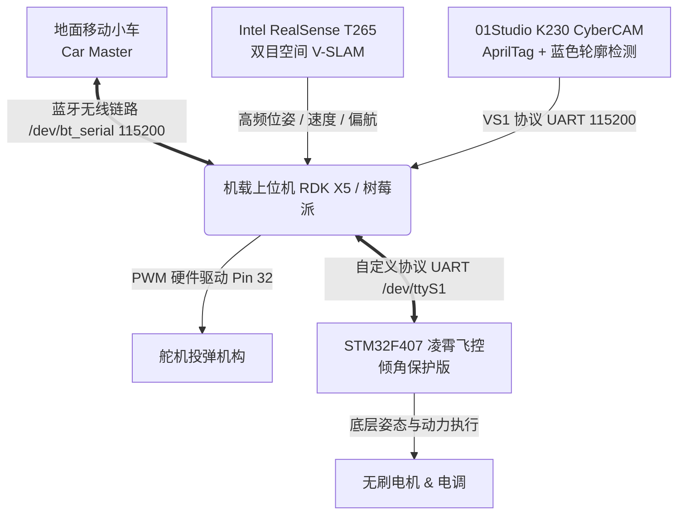

# 2026 省赛 D 题：空地协同巡航、伴飞与移动平台降落无人机系统

> **2026 年大学生电子设计竞赛（省赛）D 题全套实战源码**  
> 涵盖 STM32F407 底层飞控二次开发、01Studio K230 (CyberCAM) 边缘端视觉目标检测、机载上位机（RDK X5 / 树莓派）自主状态机与双目空间定位融合。

---

## 📖 方案架构概览

本系统面向 2026 年电赛/省赛 D 题“空地协同自主巡航、伴飞精准投放与移动小车动态降落/复飞”需求设计，具备全闭环的空地链路通信、双目空间 V-SLAM 定位以及微秒级硬件保护机制。



---

## 📁 模块构成与源码映射

```
2026-NUEDC-D/
├── README.md                           # 本说明文档
│
├── 🛸 ANO_LX_FC_倾角保护版/              # 底层飞控固件（STM32F407 Keil MDK）
│   ├── FcSrc/                          # 凌霄官方飞控核心（姿态解算、内环PID）
│   ├── DriversMcu/                     # STM32F407 / MSP432 / TM4C123 硬件驱动
│   ├── Mycode/                         # 二次开发核心逻辑
│   │   ├── angle_protect.c / .h        # 飞行倾角超限硬件级防侧翻切断保护
│   │   ├── my_protocol.c / .h          # 上位机自定义双向通信与航点指令协议
│   │   └── my_fun.c / .h               # 辅助功能扩展
│   └── ProjectSTM32F407/               # Keil uVision5 工程与固件输出
│       ├── ANO_LX_STM32F407.uvprojx    # 飞控工程主文件
│       └── ANO-LX.bin / ANO_LX.hex     # 已验证稳定固件镜像
│
├── 📷 CyberCamera/                      # K230 (CyberCAM) 边缘视觉子系统
│   ├── boards/cybercam_d/              # D 题专用视觉端部署
│   │   ├── detector.py                 # AprilTag(tag36h11) + 蓝色方块融合检测器
│   │   ├── protocol.py                 # ASCII VS1 协议帧打包器
│   │   ├── main.py                     # CSI 取流与视觉伺服数据流主循环
│   │   └── run_flight.sh               # 飞行模式高帧率启动脚本
│   └── cybercam-flight.service         # systemd 开机自启服务配置
│
└── 🧠 competition_2026_d/               # 机载上位机决策与控制核心（Python 3.10+）
    ├── main.py                         # 系统入口与核心事件循环
    ├── config.json                     # 全局参数配置（航线、PID、通信参数）
    ├── auto_start.py                   # 开机自检、空地握手与自动化起飞调度
    ├── task1_start.py / task1_flight.py # Task 1：伴飞巡航与精准投放主程序
    ├── task2_start.py / task2_flight.py # Task 2：动态小车跟踪、移动降落与二次起飞
    ├── dynamic_landing.py              # 动态移动平台降落决策与触板检测
    ├── coordinate_alignment.py         # 机身/相机/地面全局坐标系对齐转换
    ├── dual_t265_coordinate_calibration.py # 双 T265 坐标系空间联合标定
    ├── comm_diagnostic.py              # 空地通信链路与飞控通信诊断
    ├── payload_servo.py                # 硬件 PWM 舵机投放执行器
    ├── rdk_oled_monitor.py             # RDK X5 板载 OLED 状态实时刷新屏显
    ├── tests/                          # 20+ 项单元测试（涵盖协议、安全契约与模拟测试）
    └── competition-2026-d-autostart.service # 机载 Linux systemd 自启动脚本
```

---

## ⚙️ 核心技术创新点

### 1. 飞控倾角超限主动安全切断 (`angle_protect`)
在电赛近地伴飞与小车降落过程中，气流扰动容易导致边缘下洗流诱发机体倾角突变。底层固件增加了即时姿态安全防护：
- 实时检测 Roll / Pitch 绝对值：当倾角超出阈值（默认 30°），立即触发防侧翻响应与电机安全急停，杜绝地面“翻滚刮桨”。

### 2. 双重视觉融合检测 (`detector.py`)
结合 K230 硬件加速：
- **近距离精定位**：AprilTag (`tag36h11`, ID 0)，利用角点 PnP 解算精确的亚厘米级相对位姿。
- **远距离宽视场捕捉**：HSV 蓝色色块自适应多边形轮廓逼近，即使在超出 AprilTag 解析距离时仍能稳定锁定小车中心。

### 3. 空地高可靠遥测链路 (`bluetooth`)
- 机载与地面车通过 `/dev/bt_serial`（115200）建立 10Hz 双向心跳；
- 支持超时自动重传（ACK 重试 4 次）、速度前馈与丢包安全降级悬停。

---

## 🚀 部署与使用说明

### 1. 硬件连接推荐

| 设备 | 接口 | 引脚 / 端口 | 协议 / 速率 |
|------|------|------------|-------------|
| **飞控 (STM32F407)** | UART | `/dev/ttyS1` | 凌霄私有协议 / 500000 bps |
| **视觉端 (K230)** | UART | `/dev/ttyS7` | VS1 ASCII 协议 / 115200 bps |
| **地面车通信** | 蓝牙串口 | `/dev/bt_serial` | 空地双向帧 / 115200 bps |
| **空间定位 (T265)** | USB 3.0 | USB 直连 | Librealsense V-SLAM |
| **投弹舵机** | PWM | Physical Pin 32 (PWM0) | 50Hz 周期脉宽控制 |

### 2. 机载上位机依赖与运行

```bash
# 1. 安装系统依赖
sudo apt update
sudo apt install -y python3-pip python3-numpy python3-serial

# 2. 进入上位机工作目录
cd reference-projects/2026-NUEDC-D/competition_2026_d

# 3. 运行自动化系统与链路诊断
python3 comm_diagnostic.py

# 4. 执行全套安全契约单元测试
python3 -m unittest discover -s . -p "test_*.py"

# 5. 执行 Task 1（伴飞投放）
python3 task1_start.py

# 6. 执行 Task 2（动态追踪降落）
python3 task2_start.py
```

### 3. 开机自启动配置

在机载上位机系统下部署 systemd 服务：

```bash
sudo cp competition-2026-d-autostart.service /etc/systemd/system/
sudo systemctl daemon-reload
sudo systemctl enable competition-2026-d-autostart.service
sudo systemctl start competition-2026-d-autostart.service
```
